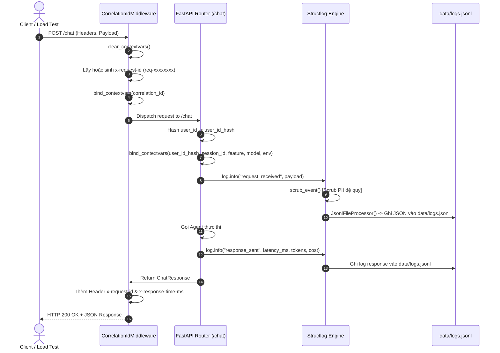
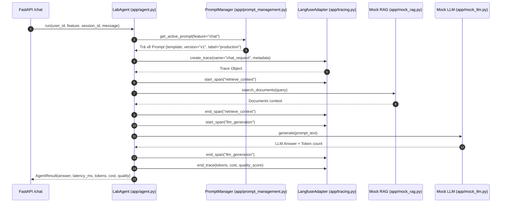
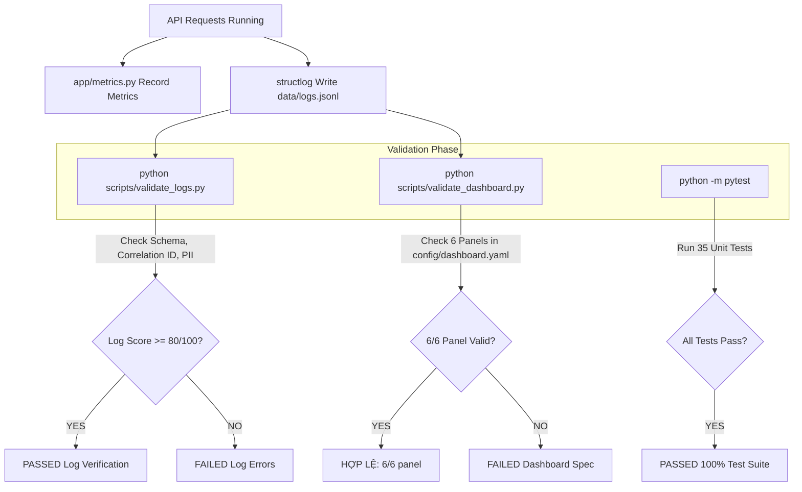

# TÀI LIỆU MÔ TẢ KIẾN THỨC VÀ LUỒNG XỬ LÝ DỰ ÁN OBSERVABILITY CHO HỆ THỐNG AI

> **Dự án**: Day 13 — Observability cho hệ thống AI  
> **Mục tiêu**: Biến một hệ thống API AI chạy được nhưng "hộp đen" (khó quan sát) thành một hệ thống có khả năng **theo dõi toàn diện (observability)**, phát hiện sự cố theo thời gian thực và giải thích nguyên nhân gốc rễ (root cause) dựa trên bằng chứng (evidence).

---

## I. TỔNG QUAN DỰ ÁN (PROJECT OVERVIEW)

Hệ thống cung cấp dịch vụ AI Agent/RAG qua API HTTP (`FastAPI`). Bài lab giải quyết bài toán lớn của các hệ thống AI thương mại trong thực tế:
- **Xử lý bất định (Nondeterminism)**: LLM có thể trả về phản hồi chậm, sai lệch hoặc phát sinh lỗi tùy thuộc vào Prompt và Input.
- **Bảo mật dữ liệu (Data Privacy & Compliance)**: Dữ liệu người dùng truyền vào AI có thể chứa thông tin định danh cá nhân (PII). Cần phải che/mã hóa trước khi ghi log.
- **Quản lý phiên bản Prompt (Prompt Versioning)**: Cho phép thử nghiệm các phiên bản Prompt (v1, v2) và Rollback tức thì khi phát sinh lỗi mà không cần redeploy toàn bộ hệ thống.
- **Truy vết 3 tầng (Triplet Observability)**: Kết nối **Metrics (Số liệu tổng quan)** ➔ **Traces (Luồng thực thi chi tiết)** ➔ **Logs (Dữ liệu chi tiết từng sự kiện)** để khoanh vùng sự cố nhanh chóng.

---

## II. KÍCH THỨC VÀ KỸ THUẬT ÁP DỤNG TRONG REPO (APPLIED KNOWLEDGE & CONCEPTS)

```
┌─────────────────────────────────────────────────────────────────────────────┐
│                          APPLIED TECHNICAL STACK                            │
├──────────────────────┬──────────────────────┬───────────────────────────────┤
│ 1. Structured Log    │ 2. Data Privacy      │ 3. LLM Tracing                │
│    - structlog JSON  │    - Regex Redaction │    - Langfuse Integration     │
│    - Correlation ID  │    - SHA-256 Hashing │    - Spans & Waterfall Metadata│
├──────────────────────┼──────────────────────┼───────────────────────────────┤
│ 4. Prompt Management │ 5. Metrics & Dashboard│ 6. Root Cause Analysis       │
│    - Label Tagging   │    - Latency/RPS/Err │    - Metrics -> Traces -> Logs │
│    - Instant Rollback│    - SLO & Alert Rules│    - Incident Injection       │
└──────────────────────┴──────────────────────┴───────────────────────────────┘
```

### 1. Structured JSON Logging & Context Propagation
- **Ghi log có cấu trúc (Structured JSON Logging)**: Sử dụng thư viện `structlog` để xuất ra các dòng log dạng JSON chuẩn theo JSON Schema (`config/logging_schema.json`). Giúp máy (Grafana, Datadog, ELK) dễ dàng parse và index.
- **Request Correlation ID**: Sử dụng `CorrelationIdMiddleware` kết hợp với `structlog.contextvars` (`clear_contextvars`, `bind_contextvars`) để gán 1 mã định danh duy nhất (`req-xxxxxxxx`) xuyên suốt toàn bộ lifecycle của 1 request (từ HTTP Header, Middleware, API Handler, Agent, tới Log và HTTP Response Header).

### 2. Bảo mật dữ liệu & Che dấu thông tin cá nhân (PII Redaction & Anonymization)
- **PII Scrubbing Đệ Quy**: Sử dụng Regex pattern trong `app/pii.py` để tự động phát hiện và thay thế các dữ liệu nhạy cảm bằng nhãn redaction:
  - Email ➔ `[REDACTED_EMAIL]`
  - Số điện thoại VN ➔ `[REDACTED_PHONE_VN]`
  - CCCD (12 số) ➔ `[REDACTED_CCCD]`
  - Thẻ tín dụng ➔ `[REDACTED_CREDIT_CARD]`
  - Hộ chiếu ➔ `[REDACTED_PASSPORT]`
- **Recursive Processor**: Processor `scrub_event` trong `app/logging_config.py` duyệt qua toàn bộ cấu trúc dữ liệu log (nested dictionary, list) để đảm bảo không rò rỉ PII vào `data/logs.jsonl`.
- **Hăm Định Danh Người Dùng (User Anonymization)**: Mã hóa `user_id` thành `user_id_hash` bằng thuật toán SHA-256 (`hash_user_id()`) để theo dõi hành vi mà không lưu trữ thông tin thực.

### 3. Distributed Tracing & Span Waterfall (LLM Tracing)
- **Langfuse Integration**: Sử dụng `LangfuseAdapter` trong `app/tracing.py` để gửi dữ liệu telemetry về Langfuse Cloud/Local.
- **Trace Waterfall Hierarchy**:
  - **Trace Root**: Đại diện cho 1 giao dịch HTTP request từ người dùng.
  - **Child Spans**: Các bước con bên trong hệ thống AI bao gồm: `retrieve_context` (RAG search), `llm_generation` (Fake/Real LLM call), `post_processing`.
- **Enriched Span Metadata**: Mọi Trace/Span đều mang các thuộc tính bổ sung: `prompt_name`, `prompt_version`, `prompt_label`, `tokens_in`, `tokens_out`, `cost_usd`, `quality_score`.

### 4. Quản lý phiên bản Prompt & Chiến lược Rollback (Prompt Management)
- **Prompt Registry**: Module `app/prompt_management.py` hỗ trợ lưu trữ nhiều phiên bản Prompt (`v1`, `v2`, ...).
- **Production Label Tagging**: Gán nhãn `production` linh hoạt cho phiên bản Prompt đang hoạt động.
- **Hot Rollback**: Khi Prompt mới (`v2`) bị chậm hoặc suy giảm chất lượng, hệ thống có thể chuyển label `production` về lại `v1` tức thì mà không cần dừng ứng dụng.

### 5. Số liệu đo lường & Cảnh báo (Metrics, Dashboard, SLO & Alerting)
- **Metrics Collection**: Module `app/metrics.py` thu thập các chỉ số thời gian thực:
  - **Latency**: p50, p95, p99 latency (ms).
  - **Traffic**: Request Per Second (RPS) / Request Per Minute (RPM).
  - **Error Rate**: Tỷ lệ phần trăm request lỗi (5xx, Timeout, Connection Error).
  - **Token & Cost**: Tổng số token in/out và chi phí ước tính (USD).
  - **Quality Proxy**: Điểm số đánh giá chất lượng phản hồi LLM.
- **Dashboard Contract**: Cấu hình `config/dashboard.yaml` được kiểm tra chặt chẽ bởi validator (`scripts/validate_dashboard.py`) đảm bảo hiển thị đúng 6 panel chỉ số chính.
- **SLO & Alert Rules**: Cấu hình mục tiêu mức dịch vụ (`config/slo.yaml`) và quy tắc phát cảnh báo (`config/alert_rules.yaml`) khi latency p95 > threshold hoặc error rate vượt mức cho phép.

---

## III. CÁC LUỒNG XỬ LÝ CHÍNH TRONG HỆ THỐNG (EXECUTION & DATA PROCESSING FLOWS)

### 🔄 Luồng 1: Xử lý Request HTTP & Ghi Log Context (HTTP Request & Logging Flow)



---

### 🔄 Luồng 2: Thực thi AI Agent, Tracing & Quản lý Prompt (Agent Execution & Tracing Flow)



---

### 🔄 Luồng 3: Thu Thập Metrics & Kiểm Tra Validator (Metrics & Validation Flow)



---

### 🔄 Luồng 4: Quy Trình Điều Tra Incident - Triplet Observability (Metrics ➔ Traces ➔ Logs)

khi xuất hiện sự cố (Incident) thông qua `inject_incident.py` (ví dụ: `rag_slow` hoặc `llm_error`), quy trình điều tra diễn ra theo 4 bước chuẩn:

```
┌─────────────────┐       ┌─────────────────┐       ┌─────────────────┐       ┌─────────────────┐
│ BƯỚC 1: METRICS │  ───> │ BƯỚC 2: TRACES  │  ───> │  BƯỚC 3: LOGS   │  ───> │ BƯỚC 4: FIX &   │
│ Phát hiện spike │       │ Khoanh vùng Span│       │ Tra cứu Root    │       │ PREVENTIVE      │
│ Latency/Error   │       │ bị lỗi/chậm     │       │ Cause bằng Log  │       │ Sửa code & test │
└─────────────────┘       └─────────────────┘       └─────────────────┘       └─────────────────┘
```

1. **Bước 1 (Metrics Dashboard)**: Quan sát Dashboard thấy chỉ số Latency p95 tăng đột biến từ `150ms` lên `3000ms`, hoặc Error Rate vọt lên `25%`.
2. **Bước 2 (Langfuse Traces)**: Mở Langfuse Trace xem danh sách các Trace gần nhất. Phát hiện các Span `retrieve_context` có thời gian phản hồi kéo dài hơn 2.5 giây. Lấy ra `trace_id` hoặc `correlation_id` tương ứng.
3. **Bước 3 (Log Deep-Dive)**: Mở `data/logs.jsonl`, filter theo `correlation_id="req-xxxx"`. Đọc log thấy thông báo lỗi/warning cụ thể (ví dụ: `incident_active: rag_slow_delay_injected` hoặc `Vector DB Timeout`).
4. **Bước 4 (Sửa lỗi & Kiểm tra)**: Tắt incident hoặc áp dụng patch sửa lỗi, chạy lại `load_test.py` và xác nhận chỉ số trên Dashboard trở lại trạng thái bình thường.

---

## IV. CẤU TRÚC MÔ-ĐUN CODEBASE (CODEBASE ARCHITECTURE & FILE MAP)

```text
Day13-K3-Observability/
├── app/                        # Mã nguồn ứng dụng chính
│   ├── main.py                 # FastAPI Application entry point & Routing
│   ├── middleware.py           # CorrelationIdMiddleware & HTTP Header context
│   ├── logging_config.py       # Structlog setup, JsonlFileProcessor & PII scrubber
│   ├── pii.py                  # PII regex patterns, text scrubbing & hashing
│   ├── tracing.py              # Langfuse Adapter cho OpenTelemetry Tracing
│   ├── prompt_management.py    # Prompt registry, versioning (v1/v2) & rollback
│   ├── agent.py                # Core LabAgent logic (kết nối RAG + LLM + Tracing)
│   ├── metrics.py              # Thu thập số liệu latency, error, token & cost
│   ├── schemas.py              # Pydantic Schemas cho API Request/Response
│   ├── challenge.py            # Module đọc và nạp file challenge chính thức
│   ├── incidents.py            # Engine mô phỏng sự cố (rag_slow, llm_error, PII leak)
│   ├── mock_llm.py             # Giả lập LLM response & tính token/cost
│   └── mock_rag.py              # Giả lập RAG vector search & document retrieval
│
├── config/                     # Cấu hình Observability & Contracts
│   ├── logging_schema.json     # JSON Schema chuẩn cho Log records
│   ├── dashboard.yaml          # Contract cấu hình 6 Panel Dashboard
│   ├── slo.yaml                # Cấu hình ngưỡng chỉ tiêu SLO (p95 latency, error rate)
│   └── alert_rules.yaml        # Quy định điều kiện phát cảnh báo (Alert Rules)
│
├── data/                       # Dữ liệu sinh ra khi hệ thống chạy
│   ├── logs.jsonl              # File lưu trữ log JSON có cấu trúc
│   └── sample_queries.jsonl    # Dữ liệu câu hỏi mẫu dùng cho load test
│
├── docs/                       # Tài liệu hướng dẫn & Quy chuẩn bài làm
│   ├── DASHBOARD_SETUP.md      # Hướng dẫn thiết lập và kiểm tra Dashboard
│   ├── PROMPT_VERSIONING.md    # Quy trình quản lý phiên bản Prompt & Rollback
│   └── GUIDE.md                # Gợi ý xử lý khi bị kẹt bài
│
├── scripts/                    # Scripts tự động hóa & Kiểm tra
│   ├── validate_logs.py        # Validator chấm điểm chất lượng Log & PII (Target >= 80/100)
│   ├── validate_dashboard.py   # Validator kiểm tra contract Dashboard & SLO (6/6 Panel)
│   ├── load_test.py            # Load test runner gửi request song song vào API
│   └── inject_incident.py      # Script kích hoạt sự cố mô phỏng
│
├── tests/                      # Bộ test tự động (Pytest Suite - 35/35 Passed)
│   ├── test_pii.py             # Test PII scrubbing regex
│   ├── test_validate_logs.py   # Test log validator engine
│   ├── test_agent_prompt_trace.py # Test Agent tracing & Metadata
│   ├── test_dashboard_validator.py# Test dashboard contract validator
│   ├── test_metrics.py         # Test metrics collector
│   ├── test_prompt_management.py  # Test prompt versioning & rollback
│   └── test_tracing_adapter.py    # Test Langfuse adapter
│
├── submission/                 # Nộp bài & Bằng chứng
│   ├── REPORT.md               # Báo cáo tổng kết incident & kết quả lab
│   └── evidence/               # Thư mục chứa hình ảnh bằng chứng (Logs, Traces, Dashboard)
│
├── phantassk.md                # Bản phân chia công việc & quy tắc 3 người làm đồng thời
└── PROJECT_OVERVIEW.md         # File tài liệu mô tả kiến thức & luồng xử lý (File này)
```

---
*Tài liệu được khởi tạo tự động dựa trên toàn bộ kiến thức và mã nguồn dự án Observability cho hệ thống AI.*
